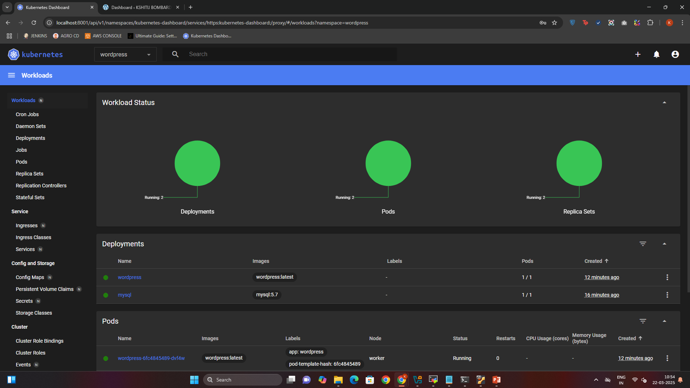
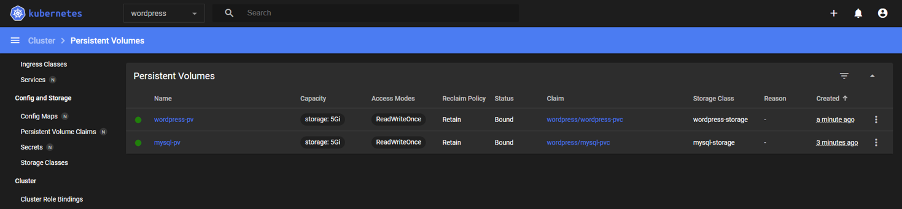
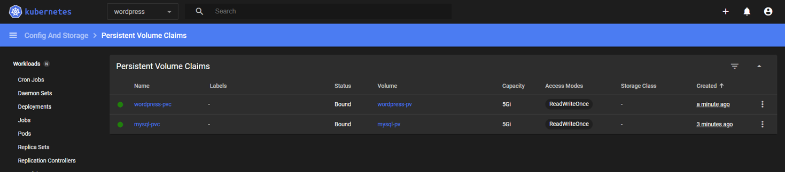
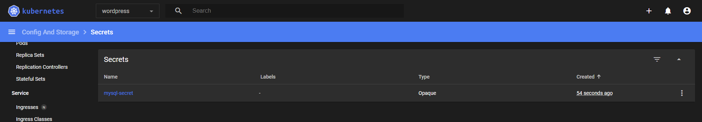
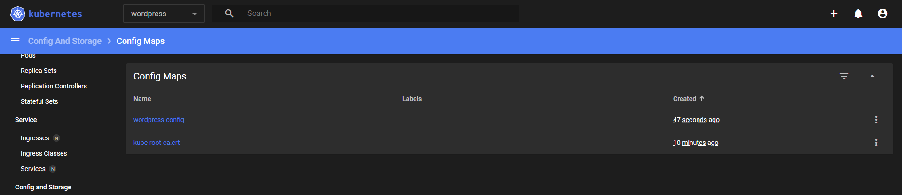
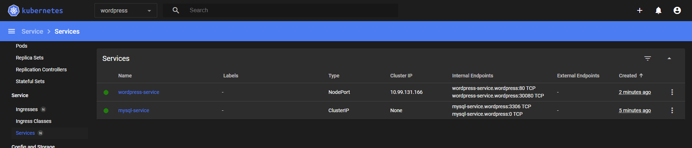
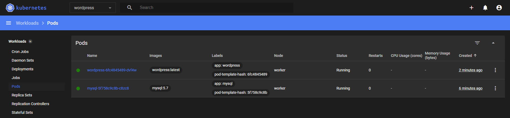
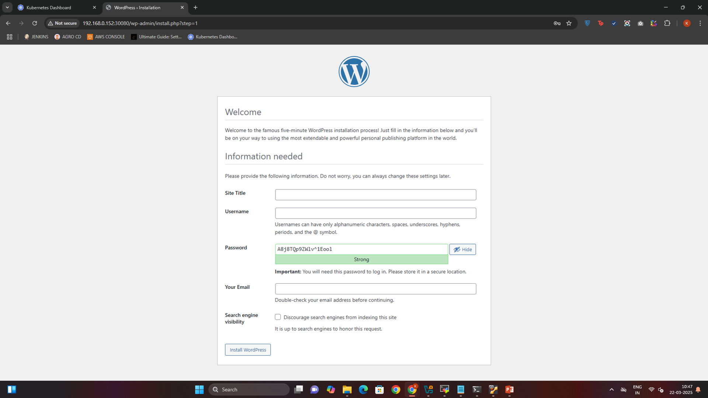
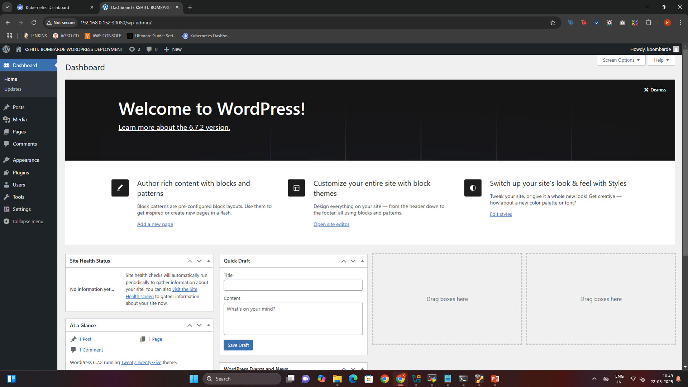

# 🚀 Kubernetes WordPress Deployment

This project deploys a fully containerized WordPress application on a Kubernetes cluster with MySQL as the database, using Persistent Storage, Kubernetes Dashboard, and NodePort for external access.

## 📌 Features

👉 WordPress + MySQL deployment using Kubernetes   
👉 Persistent Volumes (PV & PVC) for data storage  
👉 Secure Secrets Management (No hardcoded passwords)  
👉 Kubernetes Dashboard-based deployment  
👉 Access WordPress via NodePort

## 📂 Deployment Steps
### Step 1: Create Namespace
```bash
kubectl create namespace wordpress
```
### Step 2: Apply Persistent Volumes (PV & PVC)
```bash
kubectl apply -f manifests/mysql-pv.yaml
kubectl apply -f manifests/mysql-pvc.yaml
kubectl apply -f manifests/wordpress-pv.yaml
kubectl apply -f manifests/wordpress-pvc.yaml
```
### Step 3: Create MySQL Secret Securely
```bash
kubectl create secret generic mysql-secret \
  --namespace wordpress \
  --from-literal=mysql-root-password='***********' \
  --from-literal=mysql-user='wordpress' \
  --from-literal=mysql-password='***********'
```
### Step 4: Apply ConfigMap for Wordpress
```bash
kubectl apply -f manifests/wordpress-configmap.yaml
```
### Step 5: Deploy MySQL
```bash
kubectl apply -f manifests/mysql-deployment.yaml
kubectl apply -f manifests/mysql-service.yaml
```
### Step 6: Deploy Wordpress
```bash
kubectl apply -f manifests/wordpress-deployment.yaml
kubectl apply -f manifests/wordpress-service.yaml
```

### Step 7: Verify Everything is Running
```bash
kubectl get pods -n wordpress
kubectl get svc -n wordpress
```

## 🔗 Access WordPress

### Find Worker Node IP

```bash
kubectl get nodes -o wide
```
Copy the INTERNAL-IP of your worker node.

### Open WordPress in Browser

```bash
http://<INTERNAL-IP>:30800
```

## 🌆 Screenshots
#### Kubernetes Dashboard
  
#### Persistent Volumes
  
#### Persistent Volume Claims
  
#### Secrets
  
#### Config Maps
  
#### Services
  
#### Pods
  
#### Wordpress Setup Page
  
#### Wordpress Dashboard


## 🔒 Security Best Practices
✅ Use kubectl create secret instead of storing secrets in YAML  
✅ Restrict access to Kubernetes Dashboard with RBAC  
✅ Use Persistent Storage for WordPress & MySQL  
✅ Implement Role-Based Access Control (RBAC) for security  

## 🤝 Contributing
🙌 Feel free to submit pull requests or open issues if you have suggestions for improvement!

## 📝 License
📝 This project is open-source under the MIT License.